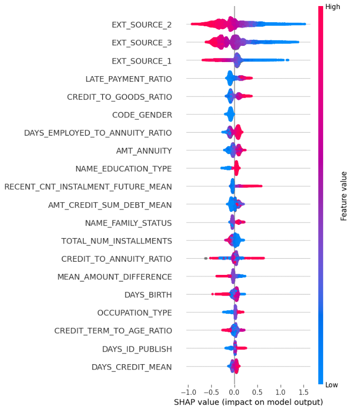
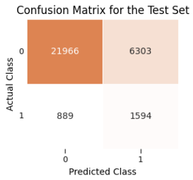
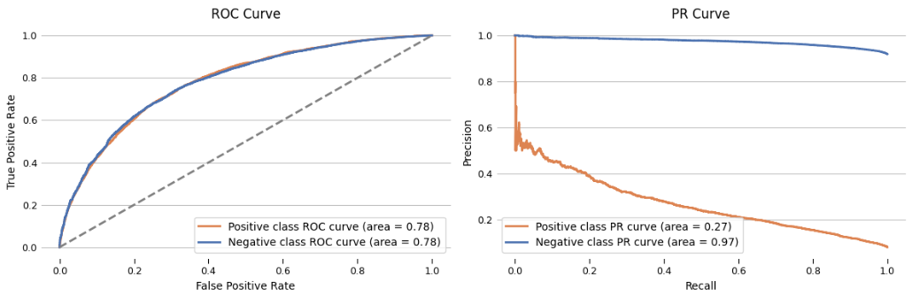
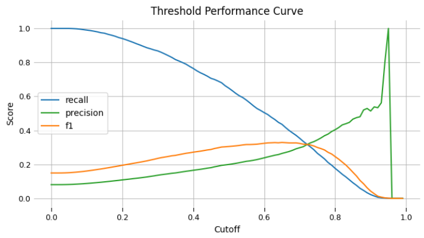

# Accessible Consumer Credit: Predicting Payment Delays


## Dataset

The dataset for this project can be found on [Kaggle](https://www.kaggle.com/competitions/home-credit-default-risk).

Home Credit is a company that offers loans and credit for everyday and mid-range purchases, such as electronics, furniture, and home appliances. The Home Credit Default Risk dataset is used to assess the likelihood of loan applicants facing repayment difficulties, focusing on early signs of risk. It includes detailed records about applicants demographics, financial behavior, and credit history, organized across multiple related tables.

Working with the Home Credit Default Risk dataset involves two main challenges. First, understanding the domain and context of the data, as the dataset includes around 200 original features, and effective feature engineering depends on identifying the most relevant information. Second, the dataset has several data quality issues, including missing values, inconsistent or nonsensical entries, and contradictory records, where important information that should be present is sometimes missing.

## Objectives

Credit scoring is the process of evaluating how likely someone is to repay a loan. This helps lenders decide whether to approve a loan and what terms to offer, such as interest rates and credit amounts. With this particular dataset, we can predict whether an applicant will be able to repay a given credit based on their personal details and loan conditions.

A deployed model should provide probability estimates for an applicant’s ability to repay, rather than simply classifying them as capable or not. For example, a probability of 0.9 indicates greater confidence in repayment ability than a probability of 0.5, even if both are classified as capable. This approach helps lenders focus on the most promising applicants.

The main objective of this project is:

> **Develop a binary classification model that can predict potential defaulters.**

To achieve this objective, the project was broken down into the following sub-objectives:

1) Perform data cleaning to understand the dataset and the issues with it.
2) Document relevant associations.
3) Engineer new predictive features.
4) Develop a well-performing classification model.
5) Create and deploy a containerized API endpoint on the cloud.

I am aiming for a high-scoring model, using as many features as needed while removing those that would lead to overfitting. Alternatively, I could use the least number of features that still achieve good performance, which may align better with practical business implementations. Reducing the number of inputs is important, as collecting and maintaining certain types of information can be costly.

## Insights Based on EDA

Analysis of these particular features is presented because they were the most important in the model. Their importance was not always due to the features themselves but often due to their ratios or interactions with other features, which added significant predictive value. While statistically significant differences were found across all associations due to the large dataset, they may not be meaningful because those differences may be too small.

Features with week assosiations with late repayments:

- Goods Price: More expensive goods baught show a very slight decrease in repayment likelihood, but the difference is negligible.
- Annuity: Higher annuities show only minimal differences in repayment likelihood.
- Number of Installments Left to Pay: Borrowers with more remaining installments on previous loans do not differ in repayment behavior.
 
Features with stronger assosiations with late repayments:

- Late Payments: Individuals who were late on previous payments are more likely to be late again.
- Outstanding Debt from Previous Loans: Borrowers with unpaid debt are more likely to miss payments.
- Gender: Males are less likely to repay on time compared to females.
- Education: Less educated individuals are less likely to repay.
- External Risk Assessments: Those flagged as high-risk by external sources are significantly more likely to be late.
- Amount of Credit Granted: Borrowers taking out larger loans are slightly less likely to repay, though the difference is modest.

## Engineered Features

Feature engineering was based on multiple approaches and domain knowledge from former [Home Credit analyst](https://www.kaggle.com/competitions/home-credit-default-risk/discussion/63032). Some of the main ideas:

- Features likely to be important, based on my understanding of the topic, mainly focusing on monetary sums related to granting or repaying credit.
- Random guesses for potentially meaningful ratios.
- Using mean, min, max, and mode aggregations as baseline techniques to merge data with the main table.
- Aggregating the most recent entries, as recent data is often more relevant.
- Creating ratios based on the most important features identified through SHAP feature importance after building the model.
- Separating different loan types based on their purpose (from the previous application table).
- Considering differences between expected and actual payments, as simple aggregations are not meaningful for the installments payments table.
- Various other ideas listed in the project markdown descriptions.



- The most important features come from the 'application' table and relate to the applicant and the loan conditions, including both the original features and the ratios I engineered. These features include the amount of credit granted, the cost of goods intended for purchase, gender, annuity amount, number of days employed, education level, family status, age, and occupation. Risk assessments from external sources were also among the key features.
- Of the 20 most important features (as shown in the SHAP plot), only four are engineered from data outside the 'application' table. These features include the number of installments remaining on previous loans, the amount of credit previously granted, the amount of previous late payments, and the difference between what was paid and the agreed amount.

## Model Selection

The algorithms tested were: Logistic Regression, Random Forest, Gradient Boosting, XGBoost, CatBoost, and LightGBM. The best performing model is LightGBM with the following hyperparameters:

```json
{
    "num_leaves": 38,
    "max_depth": 12,
    "learning_rate": 0.02344617929461838,
    "min_child_samples": 436,
    "n_estimators": 1555,
    "subsample": 0.8378290078962245,
    "colsample_bytree": 0.4772962300097477,
    "reg_alpha": 0.896502815778612,
    "reg_lambda": 0.3548361634197935
}
```

> **On the validation set, the model achieves a ROC-AUC of around 0.790, while on the test set, it scores 0.785.**

<div align="center">
    
</div>

<br>

I explored four out of the seven tables in depth but did not focus as much on the remaining three — POS CASH Balance, Credit Card, and Bureau tables. A closer look at them could improve feature engineering and further boost the model's performance.

### Business Metrics



<div align="center">
    
</div>


The cost of false negatives (FN), which occurs when a capable borrower is incorrectly rejected, means the company loses out on a potentially profitable customer, reducing its revenue. On the other hand, the cost of false positives (FP), which occurs when a non-repaying borrower is incorrectly approved, means the bank faces a financial loss. Thus, a balance between precision (false positives) and recall (false negatives) is needed to minimize both the loss of potential customers and the risk of defaults, ensuring highest profitability. This can be done by:

1) Determining the cost of false positives and false negatives.
2) Calculating the total cost at each threshold:
   Total Cost = (Cost of False Positives × FP) + (Cost of False Negatives × FN)
3) Selecting the threshold that minimizes the total cost.
4) Calculating the total loss for a person doing the job manually, the sum of the loss from misclassifications and the cost of maintaining the manual process.
5) Comparing the total loss for both approaches. The model is preferable if its total loss (including maintenance costs) is lower than the manual process's total loss.

## Cloud Deployment

For this project, the assumption is that feature engineering will be handled by another service, and the deployment is solely responsible for model inference. The deployment folder contains the values to test the model's predictions.

The deployed model API is accessible on Google Cloud at the following link:

**[Model API on Google Cloud](https://fastapi-app-680000319187.europe-central2.run.app/docs#/)**

### To Deploy Localy:

#### Step 1: Build Docker Image

Clone the repository, go to deployment folder and use docker command:

```shell
docker build -t fastapi-app .
```

#### Step 2: Run the Container

```shell
docker run -p 8080:8080 fastapi-app
```

#### Step 3: Access the App

```shell
http://localhost:8080/docs
```
